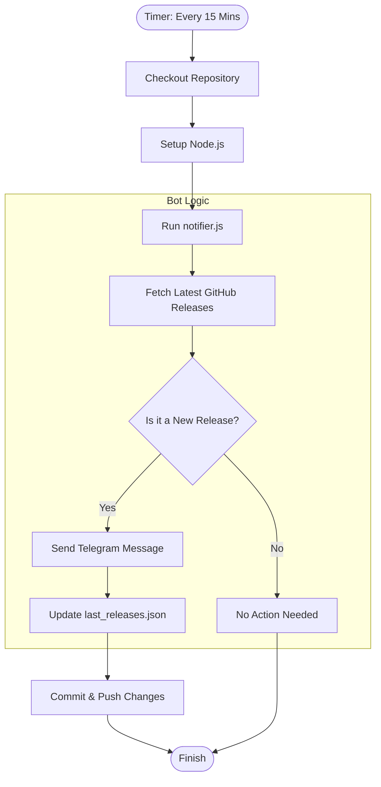

# 🚀 GitHub Release Telegram Notifier

A lightweight, automated bot that monitors GitHub repositories for new releases and sends instant notifications to a Telegram channel. Currently configured to track **Playwright** and **Selenium**.

---

## 🛠 How It Works

This project leverages **GitHub Actions** and a **Node.js** script to periodically check for updates without requiring a dedicated server.

1.  **GitHub Action (`release-monitor.yml`)**: Triggered every 15 minutes or manually. It checks out the code, sets up the Node.js environment, and executes the notifier.
2.  **Notifier Logic (`notifier.js`)**:
    *   Fetches the latest release data from the GitHub API for specified repositories.
    *   Compares the latest tag with the one stored in `last_releases.json`.
    *   If a new version is detected, it formats a message and sends it via the **Telegram Bot API**.
    *   Updates `last_releases.json` with the new tag.
3.  **State Management**: GitHub Actions commits and pushes the updated `last_releases.json` back to the repository to keep track of notified releases.

---

## 📊 Process Flow



---

## 📁 Project Structure

*   `.github/workflows/release-monitor.yml`: The automation engine that schedules the bot.
*   `notifier.js`: Core logic for API interaction and message formatting.
*   `config.js`: Configuration file where you define which repositories to track.
*   `last_releases.json`: Simple database tracking the last notified version for each repo.
*   `package.json`: Project metadata and dependencies (Axios).

---

## 🚀 Setup Instructions

Follow these steps to set up your own release notifier:

### 1. Create a Telegram Bot
1.  Message [@BotFather](https://t.me/botfather) on Telegram and create a new bot.
2.  Save the **API Token** provided.
3.  Create a Telegram Channel or Group where you want notifications.
4.  Add your bot as an administrator.
5.  Get your **Chat ID** (You can use [@userinfobot](https://t.me/userinfobot) or similar tools to find your ID or the channel ID).

### 2. Fork and Configure
1.  **Fork** this repository to your own GitHub account.
2.  Go to your fork's **Settings > Secrets and variables > Actions**.
3.  Create two **Repository Secrets**:
    *   `TELEGRAM_BOT_TOKEN`: Your bot's API token.
    *   `TELEGRAM_CHAT_ID`: Your target Chat ID.

### 3. Customize Repositories
To track different repositories, edit the `REPOS` array in `config.js`:

```javascript
// config.js
module.exports = {
    REPOS: [
        'microsoft/playwright',
        'SeleniumHQ/selenium',
        'your-org/your-repo' // Add more here
    ]
};
```

### 4. Enable the Workflow
By default, GitHub Actions may be disabled on forked repositories.
1.  Navigate to the **Actions** tab in your repository.
2.  Click "I understand my workflows, go ahead and enable them".

---

## 🛠 Local Development

If you want to run the bot locally for testing:

1.  Clone your repository.
2.  Install dependencies: `npm install`
3.  Set environment variables in your terminal:
    *   `set TELEGRAM_BOT_TOKEN=your_token`
    *   `set TELEGRAM_CHAT_ID=your_id`
4.  Run the bot: `npm start`

---

## 📜 License
This project is open-source and available under the MIT License.
