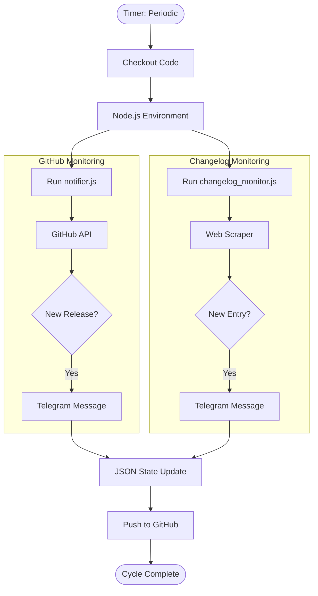

# 🚀 Release & Changelog Monitor

A sophisticated, serverless automation suite that monitors GitHub releases and product changelogs, delivering real-time notifications to Telegram. Stay ahead of the curve in the QA and AI engineering landscape.

---

## 📢 Stay Connected

Get instant updates on the latest tool releases and changelog entries by joining our official Telegram channel:

[](https://t.me/qachangelog)

**[t.me/qachangelog](https://t.me/qachangelog)**

---

## 🌟 Key Features

- **Multi-Source Monitoring**: Tracks both GitHub repository releases and external product changelog pages.
- **Intelligent Extraction**: Uses tailored methods including Cheerio (HTML), RSC (React Server Components) parsing, and JS bundle analysis.
- **Rich Notifications**: Sends beautifully formatted Telegram messages with OG images, version details, and direct links.
- **Serverless Architecture**: Runs entirely on GitHub Actions—no hosting costs, no maintenance.

### 🔍 Currently Tracking
- **Frameworks**: Playwright, Selenium, Claude Code, Gemini CLI.
- **Platforms**: Antigravity, GitHub Copilot, Cursor, Windsurf, Devin, Trae, Gemini API.

---

## 🛠 Project Architecture

This system is built with **Node.js** and automated via **GitHub Actions**.

### Components
- **`notifier.js`**: Orchestrates GitHub API fetching and Telegram messaging.
- **`changelog_monitor.js`**: Specialized scraper for tracking dynamic changelog websites.
- **`changelog_config.js`**: Centralized configuration for target products and extraction logic.
- **`.github/workflows/`**: automated schedules for continuous monitoring.

### 📊 Logic Flow



---

## 🚀 Get Started

### Join the Existing Feed
Simply join [**@qachangelog**](https://t.me/qachangelog) to receive all updates immediately.

### Fork & Host Your Own
1.  **Fork** this repository.
2.  **Configure Secrets**: Add `TELEGRAM_BOT_TOKEN` and `TELEGRAM_CHAT_ID` to your GitHub Repository Secrets (**Settings > Secrets > Actions**).
3.  **Customize Targets**:
    - Modify `REPOS` in `config.js`.
    - Modify `PRODUCTS` in `changelog_config.js`.
4.  **Enable Actions**: Navigate to the **Actions** tab and enable the workflows.

---

## 💻 Local Development

1.  Clone your fork.
2.  Install dependencies: `npm install`
3.  Set environment variables:
    ```bash
    export TELEGRAM_BOT_TOKEN="your_token"
    export TELEGRAM_CHAT_ID="your_id"
    ```
4.  Run monitors: `npm run monitor` (or `node notifier.js` / `node changelog_monitor.js`)

---

## 📜 License
MIT License © 2025.

